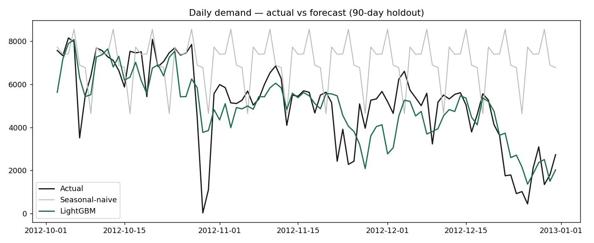

# Demand Forecasting: classical baselines vs. machine learning

Forecasting daily demand and benchmarking a **machine-learning model against classical
baselines** with a **rolling-origin backtest** and business error metrics. Built to mirror
real marketplace forecasting: predict how much demand is coming so supply can be planned
ahead of time instead of reacting to it.

> Dataset: [UCI Bike Sharing](https://archive.ics.uci.edu/dataset/275/bike+sharing+dataset)
> (731 days of daily demand with weather and calendar drivers). The same pipeline applies
> to retail/marketplace demand; only the loader changes.

## Problem
Given daily demand history and calendar/weather drivers, forecast future demand and prove
the model actually beats a naive baseline, measured the way a business cares (WAPE), not
just RMSE.

## Approach
- **Feature engineering** (`src/forecast/features.py`): calendar features (day-of-week,
  month, cyclical encodings), weather, and **leakage-safe** autoregressive features, 
  lags (1, 7, 14) and rolling mean/std (7, 14, 28), all using past values only.
- **Models** (`src/forecast/models.py`):
  - Seasonal-naive (last week): the baseline every forecast must beat
  - SARIMA(1,1,1)(1,1,1)₇: classical statistical benchmark (statsmodels)
  - LightGBM on engineered features: the ML model
- **Evaluation** (`src/forecast/backtest.py`): a proper **rolling-origin (expanding-window)
  backtest** plus a held-out final 90 days. Metrics: MAE, RMSE, MAPE and **WAPE**.

## Results (reproducible: run `python run.py`)

**Final 90-day holdout** (lower is better):

| Model          |   MAE |  RMSE | WAPE % |
|----------------|------:|------:|-------:|
| Seasonal-naive | 2256  | 2875  | 43.8   |
| SARIMA         | 2519  | 3178  | 48.9   |
| **LightGBM**   | **875** | **1178** | **17.0** |

**Rolling-origin backtest** (6 folds, 14-day horizon): mean WAPE **18.6%** (LightGBM) vs
**35.6%** (seasonal-naive), the ML model roughly halves the error, and the backtest shows
it holds across folds, not just on one lucky split.



## Run it
```bash
pip install -r requirements.txt
python run.py        # writes metrics + plot to reports/
```

## Structure
```
src/forecast/
  data.py        # load & prepare the daily series
  features.py    # calendar + weather + leakage-safe lag/rolling features
  models.py      # seasonal-naive, SARIMA, LightGBM
  backtest.py    # rolling-origin (expanding-window) cross-validation
  metrics.py     # MAE / RMSE / MAPE / WAPE
run.py           # end-to-end: train, backtest, plot
```

## Notes
WAPE is reported as the headline because it is interpretable to a business (total error as a
share of total demand) and robust to the low-count days that make MAPE explode. The pipeline
is deliberately model-agnostic so the loader can be swapped for any retail/marketplace series.
